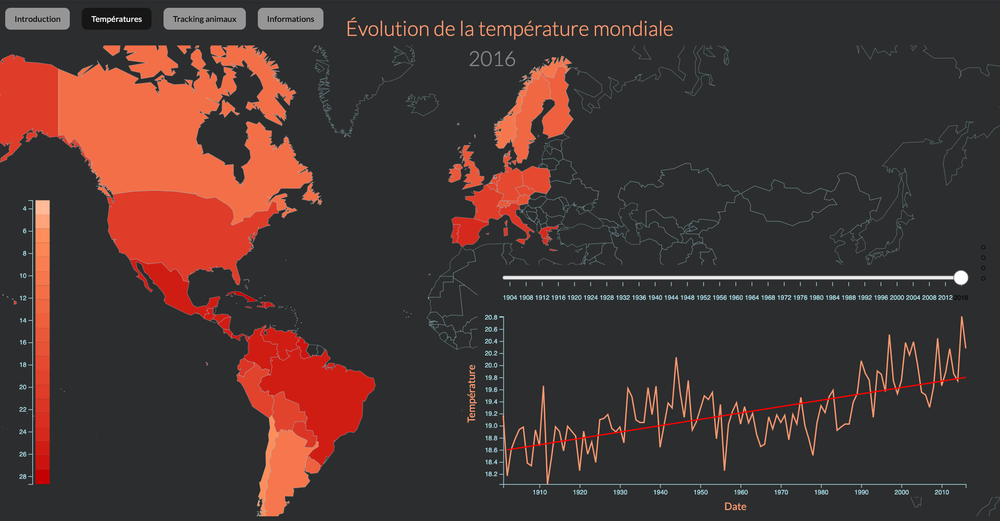

# DataViz Projet 2020-2021
KARDOUS Amina, MARTHE Guillaume, JOMAA Achref, MILIONI Théo

In this project we have tried working with real data : animal migration data.
Our goal was to be able to visualize the paths of different kinds of animals
and compare them based on temperture data. In order to point out the effect of 
global warming and hence temperature variation on the animals and their migration.

This was all built using HTML CSS and D3.js. 
## Réchauffement climatique & Migration des animaux

[Lien de notre page web de présentation](https://tpdataviz.github.io/GlobalWarming/)  
